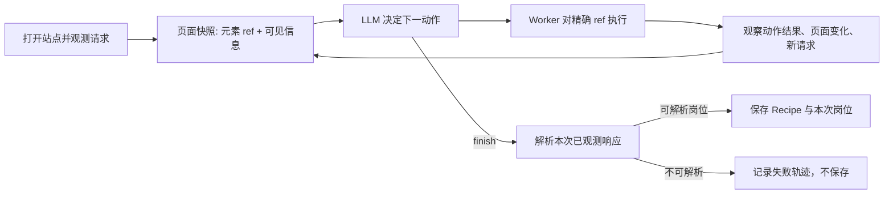

# 岗位站点探索链路：为什么最后选现在这条路

这份记录只讨论“未知招聘站点如何探索并沉淀岗位搜索路径”。它不是项目宣传，也不把每次失败包装成成果。目的是把实际做过的取舍留下来，后面面试被问到“为什么不用另一种方案”时，可以讲清当时想解决的问题、踩到的坑，以及现在方案还没解决什么。

## 先说当前结论

现在的主路径是：

1. 浏览器打开招聘站点，记录页面真实发出的请求；
2. Worker 生成当前页面的可交互元素快照，每个元素都有一次性的 `el:*` ref；
3. LLM 根据页面、网络候选、最近动作历史决定下一步；
4. 点击和搜索都带 ref，Worker 对那个真实元素执行动作；
5. Worker 返回动作结果，后端再观察 URL、页面快照和新增请求有没有变化；
6. 只有 LLM 明确 `finish`，并且后端能从本次浏览器实际收到的响应解析出岗位列表，才保存 Recipe 和本次数据；
7. 下次同一站点直接跑已保存的页面动作。实际拿不到数据时，才重新探索并覆盖旧 Recipe。

它借鉴的是 browser-use 的核心思路：模型看到的是当前浏览器状态中的元素标识，动作也作用于那个标识对应的节点；模型还会看到自己前几步做了什么、结果是什么。这里没有照搬 browser-use 的全部功能，也没有默认把截图塞进每一轮上下文。

## 决策 1：为什么搜索必须使用当前元素 ref

### 当时想做什么

最早的 Worker 有一个通用 `findSearchInput`：在整个页面扫描 `input`、`textarea` 和 `contenteditable`，优先选择 placeholder、id、class 里带“搜索 / job / position”等字样的元素。这样不需要为每个招聘网站写选择器，也能让保存下来的旧 Recipe 在新的浏览器会话中继续工作。

### 它改善过什么

对简单页面确实方便。一个旧 Recipe 只知道“搜索”，不知道某次页面快照里的具体元素，它仍然有机会找到一个看起来像搜索框的输入框。

### 后来出现了什么问题

这个“方便”混进了实时探索路径，带来两个很实际的问题：

- 同一页经常有多个输入框，例如站内搜索、职位搜索、订阅邮箱、登录输入框。重新扫描不保证会选到 LLM 当时看到的那个。
- Worker 返回“已输入并发送 Enter”只说明键盘事件没有报错，不等于网站真的提交搜索、更不等于接口返回了搜索结果。

京东的现象正好暴露了第二点：浏览器里能看到关键词写进输入框，但后续页面和候选请求没有变化。旧实现却把这一步当作“搜索动作成功”，模型会误以为自己已经验证过搜索路径。

### 现在为什么这样选

探索时，Worker 快照会给每个元素发一个临时 ref，例如 `el:5`。搜索必须带这个 ref；Worker 直接操作对应的 `ElementHandle`，不会再次扫整页猜输入框。之后是否提交成功只由下一次观测判断：URL、列表可见内容或新增请求至少要有一项变化。

这不是针对京东的规则。任何有多个输入框、同名按钮或动态组件的招聘站点都适用。

### 代价和边界

ref 只在当前页面有效。页面导航或重新渲染后，旧 ref 可能失效；此时 Worker 明确返回“ref 不存在或已过期”，模型必须依据新的快照重新选择。这比静默点错更好排查。

保存到数据库的跨会话 Recipe 不保存 ref，因为下次打开的一定是另一个页面实例。旧 Recipe 的搜索步骤仍允许 Worker 做一次通用定位回退，但这条兼容路径不参与实时探索。

## 决策 2：为什么不再在首屏强行“预搜索”

### 当时想做什么

打开页面后立刻按用户关键词搜索，期望少一次模型决策，尽快得到带关键词的接口请求。

### 为什么看起来合理

很多校招网站首页确实直接有搜索框。若能先搜，模型后续只需要检查网络候选，理论上更快也少花 token。

### 实际失败方式

首屏并不保证已经是岗位列表页，更不保证页面上只有一个正确搜索框。预搜索发生在页面快照之前，只能调用旧的全页扫描逻辑，所以它和上一个问题绑定：既无法证明输到了正确框，也无法证明 Enter 被网站接受。

它还让失败轨迹变得难读。后续模型看到的是“预搜索完成”，但事实可能只是某个输入框被写了字。模型会基于一个不可靠的前提继续判断。

### 现在为什么这样选

不再抢跑。先取得当前页面快照，再让 LLM 选择入口、列表页或搜索框；如果它选择搜索，后端补齐当前快照中的搜索 ref，再执行。多了一次状态读取，但消除了一个没有证据的“快捷动作”。

## 决策 3：为什么规则不再替 LLM 宣布探索结束

### 当时想做什么

网络请求会按 URL、JSON 结构、标题字段、分页字段等打分。曾经尝试过：请求分数足够高或模型 confidence 足够高，就直接结束，减少模型轮次。

### 它原本要解决什么

主要是减少探索时间和模型调用，并避免模型在看起来明显是列表接口时继续绕路。

### 实际失败方式

招聘网站会同时发埋点、默认列表、分类列表、搜索建议、职位列表等请求。字段名很像，不代表语义和用户搜索相同。尤其当搜索词没有真正提交时，规则很容易把默认列表当成搜索结果。

这会导致最危险的一类错误：探索“成功”并保存了一个看似可用、实则错误的 Recipe。后续 Fast Path 失败时，问题表面上看像接口失效，实际根因是第一次就沉淀错了路径。

### 现在为什么这样选

规则只负责安全和事实约束：请求是否已经 inspect、ref 是否过期、是否超过步数、浏览器有没有真实变化。是否已经找到了岗位列表，必须由 LLM 结合完整语义明确输出 `finish`。即便到了步数上限，也只记录失败，不生成 Recipe。

这会多消耗一些推理，但避免把“快”建立在错误成功上。

## 决策 4：为什么模型要看到多步历史，而不是只看上一条结果

### 当时想做什么

最早只传 `LastActionResult`，为了缩短 prompt，减少 token。

### 实际失败方式

模型看不到两步前已经 inspect 过哪个请求。一次观测后候选列表又可能为空，于是它会再次要求 inspect 同一个 seq，后端也很难知道这是重复还是新的上下文。

京东的一次失败轨迹中就出现了重复 inspect 同一个请求，后面逐步消耗到上限。这不是网站特性，而是状态信息被压缩得过头。

### 现在为什么这样选

传最近六步“动作 + 目标 + 结果”，并且后端拒绝对已经 inspect 且没有新候选的请求重复调用。拒绝不是判定探索失败；模型下一轮能看到明确原因，应该改选其他页面动作。

六步不是神奇数字，只是一个有限、足够覆盖近因的窗口。以后若有实际日志证明不够，再调整，而不是先把所有历史和整页 HTML 都塞给模型。

## 决策 5：为什么不在首次探索后额外 replay 接口做“验证”

### 当时想做什么

探索到一个接口后，脱离页面再请求一次，想证明 Recipe 下次也能跑。

### 实际失败方式

很多招聘站点的接口依赖浏览器上下文：Cookie、动态 token、referer、请求顺序、甚至临时风控状态。页面里刚拿到过 JSON，不代表独立 replay 也允许访问。阿里站点就出现过这种情况：页面已经显示搜索结果、浏览器里也能看到 JSON，脱离页面 replay 却拿到 403。

这类 replay 不仅不能证明 Recipe 错了，反而会制造额外请求、消耗模型和调试时间，并把“反爬限制”误诊为“探索失败”。

### 现在为什么这样选

首次探索只验证浏览器本次真实收到的响应能否解析岗位，并直接保存本次结果。Recipe 是否能复用由下一次正常调用验证：Fast Path 成功就是验证成功；真实调用失败才进入重新探索，并覆盖旧 Recipe。

这是更接近用户流程的验证，也不会为了验证再制造一条脱离上下文的请求。

## 决策 6：为什么删掉另一套通用 AI 导航器

### 当时想做什么

项目里曾保留一套“抓整页文本 -> LLM 输出点击/滚动 -> 再抓整页文本”的通用导航器，作为未知站点的兜底。它的初衷是兼容早期接口，也让 `strategy=ai` 有单独的调试含义。

### 实际失败方式

它与 Explorer 同时存在后，同一个“AI 探索”会走两种模型输入、两种执行方式和两种结束条件。一个是文本匹配点击，没有精确 ref 和网络观测；另一个是快照 + ref + 网络请求。遇到失败时，很难确认到底是哪套逻辑运行了。

这也是此前“同一站点上一轮像能跑、下一轮却行为不同”的重要结构性原因之一。不是每次都由站点变化造成，也可能是请求参数把它带进了另一个旧路径。

### 现在为什么这样选

未知站点只有 Explorer 一条探索路径。历史 `strategy=ai` 被视为 `explore` 的别名，避免老前端或手工 curl 不小心落到旧导航器。已知站点的半固定抽取脚本仍保留，因为它们不是另一套“未知站点探索”，而是已验证过的 Fast Path。

## 没有采用的做法

### 每一步都用截图让模型看

截图对 canvas、没有可访问语义的自定义组件、强视觉验证码页面很有帮助。但默认每步传图会扩大上下文和延迟，也无法替代真实 DOM ref 的精确操作。当前先用 DOM 快照和网络观测；只有明确证据表明页面没有可用语义元素、且人工可视操作仍可进行时，才值得把截图作为受控降级路径。

### 为每家招聘网站写一套搜索流程

这会让短期 demo 很快，但无法体现探索能力，维护成本也会随站点数线性增长。项目允许对稳定、已验证的站点保存 Recipe 或配置半固定抽取器；未知站点的第一次路径仍必须由通用浏览器状态驱动。

### 只靠字段名判断 JD

字段名只是一种弱线索。职责可能叫 `workContent`、`duty`、`responsibility`，要求可能叫 `qualification`、`requirement`。当前候选构建会把响应语义交给 LLM 判断，同时把字段结构、请求体和完整样本交给它，而不是只认 `jobDescription`。

## 当前仍然存在的限制

- 有些站点在浏览器界面显示了结果，但不产生可被当前网络观察器识别的岗位 JSON；这种情况不能假装探索成功，需要继续改进观察能力或走渲染页抽取。
- 登录、验证码和强反爬不能自动绕过。Worker 只复用用户在持久浏览器目录中手动完成的登录态。
- “按 Enter”被发送不代表站点提交搜索。因此它只是一条动作结果，必须由后续状态变化确认。
- Recipe 的跨会话搜索步骤无法保存一次性的 DOM ref，只能在 Fast Path 中使用受控的通用定位回退。这是当前设计中仍需持续观测的风险点。

## 面试时可以怎么讲

**为什么不用纯规则？**

规则适合校验事实和安全边界，比如 ref 是否有效、请求是否重复、页面有没有变化；但“这个 JSON 是否真的是岗位列表、字段分别代表职责和要求”是语义问题。纯规则容易把默认列表或分类接口误判为搜索结果，所以最终完成由模型决定，规则不替模型宣布成功。

**为什么不是每个站点都手写爬虫？**

稳定站点可以沉淀 Recipe 或脚本，未知站点先用通用探索。这样把一次探索成本换成后续 Fast Path，代码不会随公司数量无限堆站点分支。

**如何控制 agent 的不确定性和成本？**

不是简单减少调用次数，而是删掉没有证据的调用：取消首屏盲目预搜索、取消脱离页面的 replay 验证；每步只传有限状态，保留最近动作历史；达到上限明确失败且不保存错误 Recipe。先保证结果可信，再优化轮次。

**browser-use 对这个项目的影响是什么？**

不是直接复制库，而是采用它的状态机思想：模型基于当前浏览器可交互元素做选择，工具按元素身份执行，工具结果再回到下一轮状态。项目额外保留了招聘场景需要的网络请求观察、Recipe 持久化和岗位字段解析。
